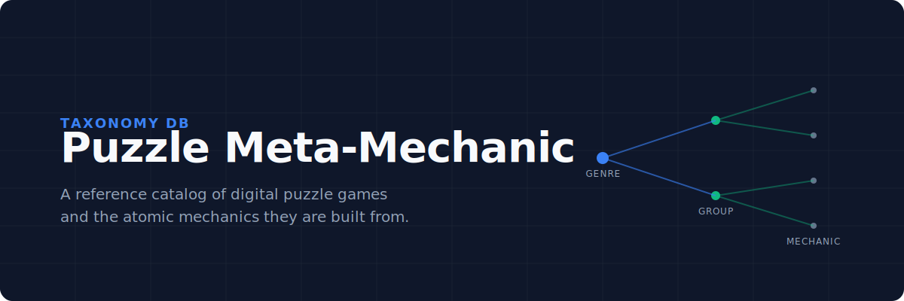

<div align="center">
  
</div>

<br />

**Puzzle Meta-Mechanic** is a reference catalog of digital puzzle games and the atomic mechanics they are built from. Initially designed as an internal tool, it serves to map the taxonomy of puzzle games by breaking them down into their smallest indivisible units of interaction.

## What is this?

This database maps the complex relationships between puzzle games and their underlying mechanics. It is designed for game designers, developers, and puzzle enthusiasts looking to understand how puzzle games are constructed.

### Core Concepts

- **Game**: A released digital puzzle game title (e.g. Braid, Portal) cataloged with its platforms, genres, and mechanics.
- **Mechanic** (Atomic Mechanic): The smallest indivisible unit of puzzle interaction (e.g. Push, Pull, Frictionless Slide). Always belongs to exactly one Mechanic Group.
- **Mechanic Group**: A family of related atomic mechanics (e.g. Object Manipulation, Spatial Navigation & Movement).
- **Genre**: A macro-classification of puzzle games (e.g. Match-3, Sokoban-like, Merge). A Genre correlates with mechanics but does not contain them.

## Data Structure

The catalog content is driven by a taxonomy stored in `private/`. It links games to their mechanics via **Mechanic Usage** relationships, noting whether a mechanic acts as the core gameplay loop, a secondary feature, or a unique twist.

## Getting Started

This catalog is built with **Next.js** and **Prisma**. To run the catalog locally and explore the database:

1. **Install dependencies**
```bash
npm install
```

2. **Run the development server**
```bash
npm run dev
# or
yarn dev
# or
pnpm dev
# or
bun dev
```

3. **Explore**
Open [http://localhost:3000](http://localhost:3000) with your browser to see the catalog.

## Learn More

- Examine `CONTEXT.md` for the exact definitions of the taxonomy.
- Explore the Next.js frontend in the `src/` directory.

---
*If you find this project helpful, consider starring the repository!*
